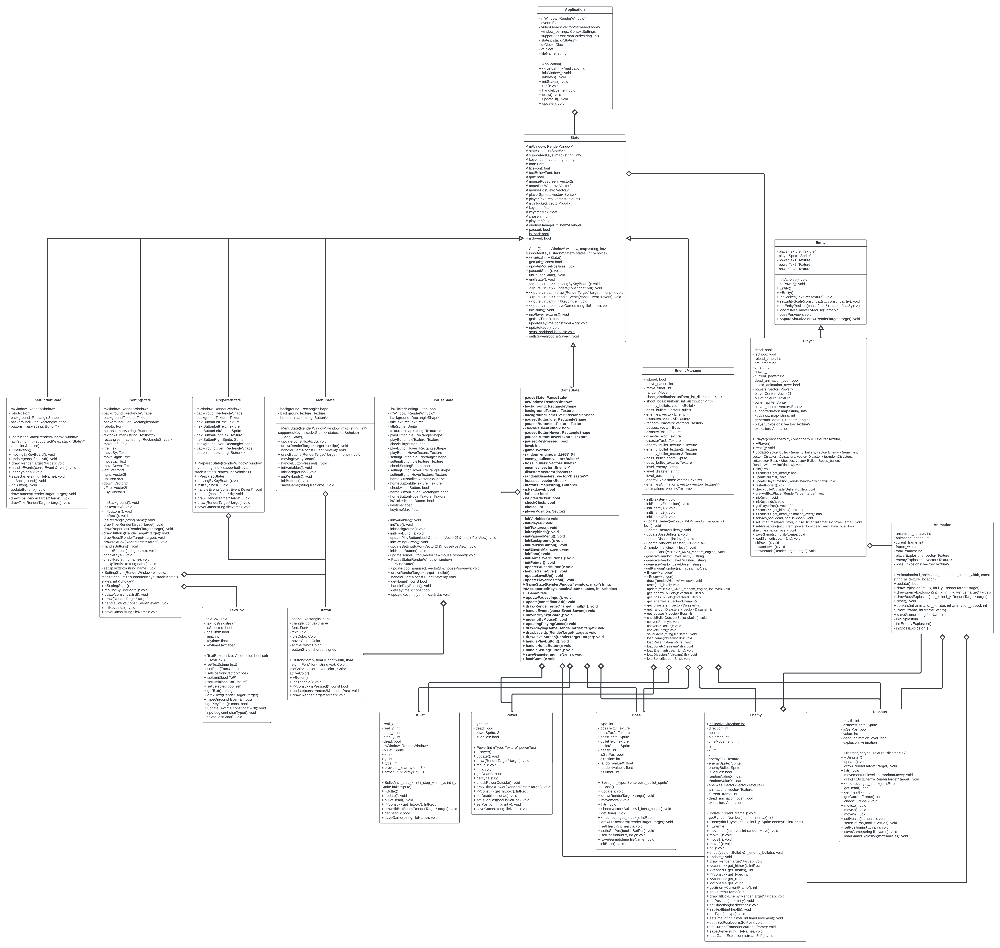

# CS202-Meow-Invaders
Solo project in CS202 inspired by the game 'Chicken Invaders' created by Lương Nguyên Khoa from APCS22 at the University of Science (HCMUS).

## Project Architecture


## Report
[Read here.](./Report.pdf)

## Video
[Click here.](https://www.youtube.com/watch?v=LxEIvTV5yOo&t=2s)

## Goal achieved from the project

- To gain a better understanding of the principles in OOP concept and using SFML library.
- To learn how to efficiently manage time and solve challenging problems.

## Build instructions
- Requirements:
  - Latest version of [CMake](https://cmake.org).
  - [SFML](https://www.sfml-dev.org/download.php)

- This project is designed to be cross-compatible, however, it has only primarily tested on MacOS (Clang) and Linux (GCC). We haven't tested on Windows (MSVC).

1. Create a new `build` directory at the root of the project.
2. Then execute

```bash
   ./build.sh
```

3. Finally, run

```bash
   ./run.sh
```